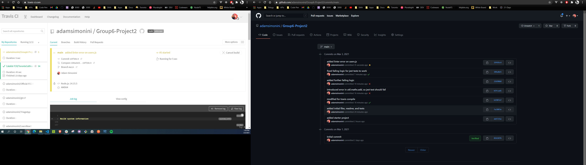
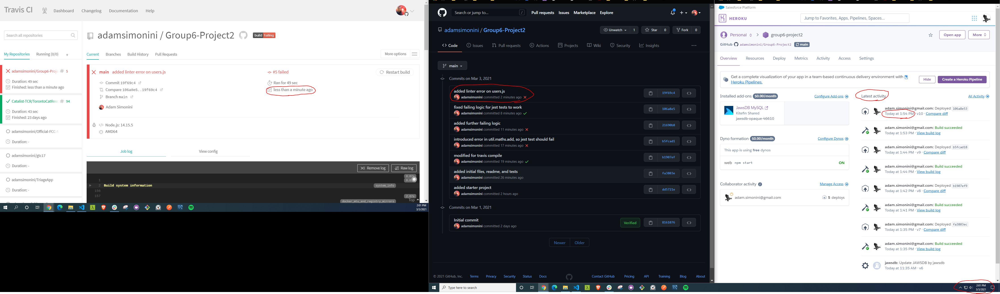

# **Group6-Project2**
Second project for coding bootcamp

## **ESLint**

ESLint validates our code. It runs tests against our code based on syntax rules we specifiy (e.g., always use double quotes, never use the var keyword, etc). A .eslintrc.json file on the repo root extends prettier, meaning rules specified there are used by prettier to auto-format our code. The .eslintrc.json file will provide rules for your linter if the eslint-plugin-prettier is an installed npm package. This means each repo may have it's own linting standards.

[List of ESLint Rules](https://eslint.org/docs/rules/)

We use .eslintignore to specifiy foreign code, so that we aren't applying our linting against it.

## **Prettier**
Prettier is an auto-formatter. If configured the same way across your team, you should be able to press Ctrl+Alt+F (or whatever you have your prettier shortcut set to) to automatically format your code. Prettier can be configured directly in VSCode. To do so, press "ctrl+," to bring up VSCode settings, and then search "prettier". 

Your local VSCode's instance of prettier rules will be overwritten by the project's eslintrc.json file.
We can override that file with the .prettierrc.json file. Be cautious that this override can lead to bad results, as your autoformatter will be implementing rules out of tandem with the rules specified within your .eslintrc.json.

## **Travis CI**
[Continuous integration](https://www.youtube.com/watch?v=1er2cjUq1UI&ab_channel=IBMCloud) is the developer practice of pushing code changes with a high frequency. This helps in avoiding merge conflicts, delivering features faster, and ensuring that there is always a working build of the application in production. However, there is a problem: continuous integration increases the need for frequent testing. As always, with each commit there is a risk that the app will break.

To solve this problem - the problem of an increased likelihood of errors arising due to a high frequency commits - developers employ a script to build the code, and to run it against tests each and every time a commit is made to a notable branch (e.g., the quality assurance, or/and the production branch).

We will use Travis CI to watch over our main branch, rebuild the app each time a commit is made to main, run our linter against the code, run our unit tests against the code, and prevent Heroku from rebuilding the app if the new code fails any of the aforementioned tests. 

### **Build in progress**

### **Failed build**
